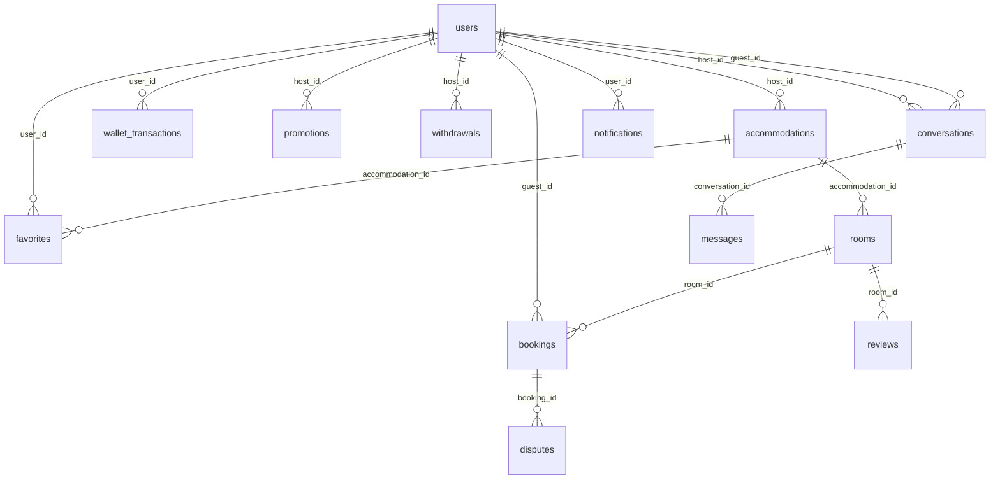

# ERD — ROVVA Homestay Platform

> Sơ đồ quan hệ sinh từ SQLAlchemy models (`backend/app/models/`).  
> **Cập nhật:** 12/07/2026 — 13 bảng SQLite (`instance/rova_host.db`)

---

## Sơ đồ tổng quan (Mermaid)



---

## Bảng `users`

Model: `backend/app/models/user.py`

| Cột | Kiểu | Ràng buộc | Mô tả |
|-----|------|-----------|-------|
| id | INTEGER | PK | |
| full_name | VARCHAR(120) | NOT NULL | |
| email | VARCHAR(120) | UNIQUE, NOT NULL | |
| password_hash | VARCHAR(255) | nullable | Werkzeug hash |
| phone | VARCHAR(20) | | |
| id_card | VARCHAR(20) | | CCCD — dùng cho host onboarding |
| introduction | TEXT | | |
| gender | VARCHAR(10) | | |
| birthday | DATE | | |
| city | VARCHAR(120) | | |
| avatar | VARCHAR(255) | | Path legacy; UI dùng property `avatar_url` |
| role | VARCHAR(20) | default `guest` | `guest`, `host`, `admin` |
| admin_role | VARCHAR(20) | nullable | `super`, `admin`, `support` |
| created_at | DATETIME | | |
| is_email_verified | BOOLEAN | default false | |
| email_verification_token | VARCHAR(255) | | |
| reset_password_token | VARCHAR(255) | | |
| reset_password_expiry | DATETIME | | |
| failed_login_attempts | INTEGER | default 0 | |
| is_locked | BOOLEAN | default false | |
| host_status | VARCHAR(20) | default `none` | `none`, `pending`, `approved`, `rejected` |
| host_document_path | VARCHAR(255) | | Giấy tờ đăng ký host (mô phỏng) |

**Quan hệ:** 1 user (host) → N `accommodations`, `promotions`, `withdrawals`, `conversations` (as host). Backref: `wallet_transactions`, `favorites`, `notifications`. Model `Booking` có FK `guest_id` nhưng **chưa** khai báo `relationship` trên `User`.

---

## Bảng `accommodations`

Model: `backend/app/models/accommodation.py`

| Cột | Kiểu | Ràng buộc | Mô tả |
|-----|------|-----------|-------|
| id | INTEGER | PK | |
| host_id | INTEGER | FK → users.id, NOT NULL | |
| name | VARCHAR(200) | NOT NULL | |
| type | VARCHAR(50) | default `Homestay` | Homestay, Villa, Khách sạn, Resort, … |
| city, district | VARCHAR | | |
| address | VARCHAR(500) | | |
| location | VARCHAR(200) | | |
| description | TEXT | | |
| image | VARCHAR(255) | | Legacy; UI dùng `cover_url` |
| status | VARCHAR(20) | NOT NULL | `active`, `pending`, `paused`, `draft`, `rejected` |
| features | JSON | | Tiện ích CSLT |
| allows_pets | BOOLEAN | default false | |
| check_in_time | VARCHAR(10) | default `14:00` | |
| check_out_time | VARCHAR(10) | default `12:00` | |
| cancellation_policy | VARCHAR(255) | | |
| house_rules | TEXT | | |

**Quan hệ:** 1 CSLT → N `rooms` (cascade delete-orphan), N `favorites`.

---

## Bảng `rooms`

Model: `backend/app/models/room.py`

| Cột | Kiểu | Ràng buộc | Mô tả |
|-----|------|-----------|-------|
| id | INTEGER | PK | |
| accommodation_id | INTEGER | FK → accommodations.id, NOT NULL | |
| name | VARCHAR(200) | NOT NULL | |
| bed_info | VARCHAR(100) | | |
| capacity | INTEGER | default 2 | |
| area | VARCHAR(50) | | |
| base_price | INTEGER | default 0 | VND/đêm |
| description | TEXT | | |
| image | VARCHAR(255) | | Legacy; UI dùng `image_url` |
| features | JSON | | Tiện ích phòng |
| services | JSON | | `[{name, price, unit, checked}]` |
| check_in_time | VARCHAR(10) | | |
| check_out_time | VARCHAR(10) | | |
| cancellation_policy | VARCHAR(255) | | |
| status | VARCHAR(20) | NOT NULL | `active`, `pending`, `paused`, `draft` |

**Quan hệ:** 1 room → N `bookings`, N `reviews`.

---

## Bảng `bookings`

Model: `backend/app/models/booking.py`

| Cột | Kiểu | Ràng buộc | Mô tả |
|-----|------|-----------|-------|
| id | INTEGER | PK | |
| booking_code | VARCHAR(20) | UNIQUE, INDEX | VD: `#RV4CC9BC` |
| room_id | INTEGER | FK → rooms.id, NOT NULL | |
| guest_id | INTEGER | FK → users.id, NULL | Khách đăng nhập; NULL = vãng lai |
| guest_name | VARCHAR(120) | NOT NULL | Snapshot |
| guest_phone | VARCHAR(20) | | |
| guest_email | VARCHAR(120) | | |
| guest_count | INTEGER | default 1 | |
| guest_note | TEXT | | |
| check_in | DATE | NOT NULL | |
| check_out | DATE | NOT NULL | |
| total_amount | INTEGER | default 0 | VND |
| status | VARCHAR(20) | NOT NULL | `holding`, `confirmed`, `cancelled`, `completed` |
| payment_status | VARCHAR(20) | NOT NULL | Xem bảng từ điển bên dưới |
| payment_method | VARCHAR(50) | | `online`, `cash` |
| payment_gateway_ref | VARCHAR(255) | | Sinh khi thanh toán online mock |
| commission_fee | INTEGER | default 0 | 15% tại checkout |
| host_payout_amount | INTEGER | default 0 | |
| hold_expiry_at | DATETIME | | Giữ chỗ **20 phút** |
| disbursed_at | DATETIME | | Ngày giải ngân host |
| created_at | DATETIME | | |

**Property:** `nights` — số đêm từ check_in/check_out.

**Từ điển `payment_status` (thực tế codebase):**

| Ngữ cảnh | Giá trị dùng |
|----------|--------------|
| Customer checkout online | `paid` |
| Customer checkout tiền mặt | `pending` |
| Host payment portal | `pending`, `disbursed`, `in_dispute`, `resolved` |
| Seed demo | Cả hai nhóm giá trị |

**Quan hệ:** 1 booking → N `disputes` (thường 0–1).

---

## Bảng `disputes`

Model: `backend/app/models/dispute.py` (hoặc tương đương trong models)

| Cột | Kiểu | Ràng buộc | Mô tả |
|-----|------|-----------|-------|
| id | INTEGER | PK | |
| dispute_code | VARCHAR(20) | UNIQUE, NOT NULL | |
| booking_id | INTEGER | FK → bookings.id, NOT NULL | |
| status | VARCHAR(20) | NOT NULL | `needs_response`, `processing`, `resolved` |
| guest_complaint | TEXT | NOT NULL | |
| guest_evidence | TEXT | | JSON URLs |
| host_response | TEXT | | |
| host_evidence | TEXT | | JSON URLs |
| admin_resolution | TEXT | | |
| refund_amount | INTEGER | default 0 | |
| created_at, updated_at | DATETIME | | |

**Lưu ý:** Customer **không có** route mở dispute; dữ liệu từ seed + xử lý host/admin.

---

## Bảng `reviews`

Model: `backend/app/models/review.py`

| Cột | Kiểu | Ràng buộc | Mô tả |
|-----|------|-----------|-------|
| id | INTEGER | PK | |
| room_id | INTEGER | FK → rooms.id, NOT NULL | |
| guest_name | VARCHAR(100) | NOT NULL | |
| guest_avatar | VARCHAR(255) | | |
| booking_code | VARCHAR(50) | | Liên kết booking |
| rating | INTEGER | NOT NULL | 1–5 |
| detail_ratings | JSON | | `location`, `service`, `cleanliness`, `amenities` |
| images | JSON | | URL ảnh — cột có; route viết review chưa lưu upload |
| content | TEXT | | |
| reply | TEXT | | Host reply |
| created_at | DATETIME | | |
| reply_at | DATETIME | | |

**Không có** `guest_id` FK — chỉ snapshot `guest_name`.

---

## Bảng `promotions`

| Cột | Kiểu | Ràng buộc | Mô tả |
|-----|------|-----------|-------|
| id | INTEGER | PK | |
| host_id | INTEGER | FK → users.id, NOT NULL | |
| name | VARCHAR(200) | NOT NULL | |
| type | VARCHAR(50) | NOT NULL | `Giảm %`, `Giảm cố định` |
| discount_value | VARCHAR(50) | | |
| start_date, end_date | VARCHAR(20) | | |
| min_nights | INTEGER | default 1 | |
| apply_days | VARCHAR(50) | | |
| not_combine | BOOLEAN | default false | |
| applied_to | JSON | | Cây CSLT/phòng áp dụng |
| status | BOOLEAN | default true | |
| created_at | DATETIME | | |

**Lưu ý:** Checkout customer dùng mã cứng `WELCOME10`, `ROVVA50` — **chưa** đọc bảng `promotions`.

---

## Bảng `withdrawals`

| Cột | Kiểu | Ràng buộc | Mô tả |
|-----|------|-----------|-------|
| id | INTEGER | PK | |
| host_id | INTEGER | FK → users.id, NOT NULL | |
| amount | INTEGER | NOT NULL | |
| bank_account | VARCHAR(255) | NOT NULL | Hardcode demo khi rút |
| status | VARCHAR(20) | NOT NULL | `pending`, `completed` |
| created_at | DATETIME | | |
| completed_at | DATETIME | | nullable |

---

## Bảng `favorites`

| Cột | Kiểu | Ràng buộc | Mô tả |
|-----|------|-----------|-------|
| id | INTEGER | PK | |
| user_id | INTEGER | FK → users.id, NOT NULL | |
| accommodation_id | INTEGER | FK → accommodations.id, NOT NULL | |
| added_at | DATETIME | | |

---

## Bảng `wallet_transactions`

| Cột | Kiểu | Ràng buộc | Mô tả |
|-----|------|-----------|-------|
| id | INTEGER | PK | |
| user_id | INTEGER | FK → users.id, NOT NULL | |
| type | VARCHAR(50) | NOT NULL | `earn`, `spend` |
| amount | INTEGER | NOT NULL | Xu |
| description | VARCHAR(255) | | |
| created_at | DATETIME | | |

**Số dư:** `sum(earn) − sum(spend)`. Checkout có checkbox giảm 50.000đ nhưng **chưa** ghi `spend`.

---

## Bảng `conversations` & `messages`

Model: `backend/app/models/message.py`

### conversations

| Cột | Kiểu | Ràng buộc |
|-----|------|-----------|
| id | INTEGER | PK |
| host_id | INTEGER | FK → users.id, NOT NULL |
| guest_id | INTEGER | FK → users.id, NULL |
| guest_name | VARCHAR(120) | NOT NULL |
| guest_email | VARCHAR(120) | NOT NULL |
| guest_phone | VARCHAR(20) | |
| created_at, updated_at | DATETIME | |

### messages

| Cột | Kiểu | Ràng buộc |
|-----|------|-----------|
| id | INTEGER | PK |
| conversation_id | INTEGER | FK → conversations.id, NOT NULL |
| sender_type | VARCHAR(20) | NOT NULL — `host` / `guest` |
| content | TEXT | NOT NULL |
| is_read | BOOLEAN | default false |
| created_at | DATETIME | |

---

## Bảng `notifications`

| Cột | Kiểu | Ràng buộc | Mô tả |
|-----|------|-----------|-------|
| id | INTEGER | PK | |
| user_id | INTEGER | FK → users.id, NOT NULL, INDEX | Thường là host |
| title | VARCHAR(200) | NOT NULL | |
| body | TEXT | | |
| category | VARCHAR(50) | default `system` | `booking`, `payment`, `dispute`, `system` |
| link_url | VARCHAR(255) | | Deep link portal |
| is_read | BOOLEAN | default false | |
| created_at | DATETIME | | |

**Runtime:** UI host đọc bảng này; event booking/message mới **chưa** tạo notification — chủ yếu từ seed.

---

## Luồng dữ liệu chính

```text
User (host) → Accommodation → Room → Booking ← User (guest, nullable)
                                      ↓
                                   Dispute
Room → Review
User (host) → Promotion / Withdrawal
User (host) ↔ User (guest) → Conversation → Message
User (customer) → Favorite, WalletTransaction
User → Notification
```

---

## Ghi chú thiết kế

1. **Media** không lưu blob — xem [HUONG_DAN_ANH_DEMO.md](HUONG_DAN_ANH_DEMO.md).
2. **Snapshot khách** trên `bookings` hỗ trợ khách vãng lai (`guest_id=NULL`).
3. **`hold_expiry_at`** — timeout 20 phút (`HOLD_MINUTES=20`).
4. **Trợ lý vận hành thông minh** không có bảng riêng — tính realtime từ bookings/reviews/messages. Gợi ý giá & doanh thu thiết kế dùng ML; hiện giả lập rule-based.
5. **Smart Match** đọc SQLite qua pandas, không qua ORM session.
6. **Tổng cộng 13 bảng** trong metadata SQLAlchemy hiện tại.

---

## Lệnh kiểm tra schema

```powershell
py -c "
from run import app
from backend.app.extensions import db
with app.app_context():
    for t in db.metadata.sorted_tables:
        print(t.name)
"
```

Kết quả mong đợi: `accommodations`, `bookings`, `conversations`, `disputes`, `favorites`, `messages`, `notifications`, `promotions`, `reviews`, `rooms`, `users`, `wallet_transactions`, `withdrawals`.
