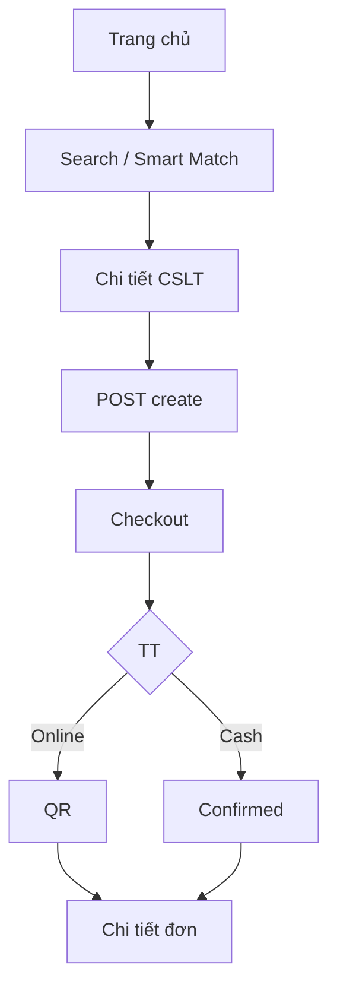
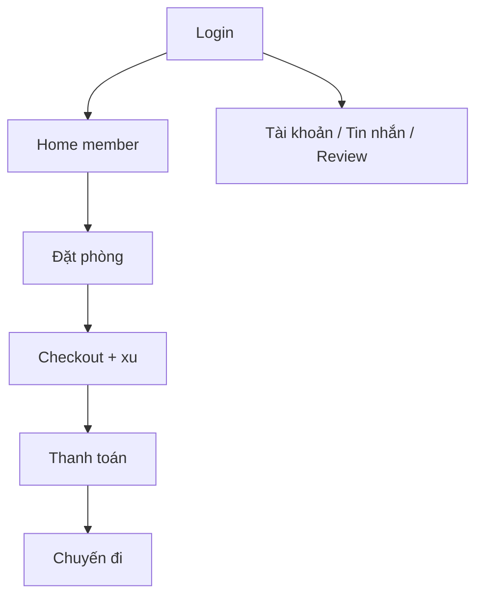
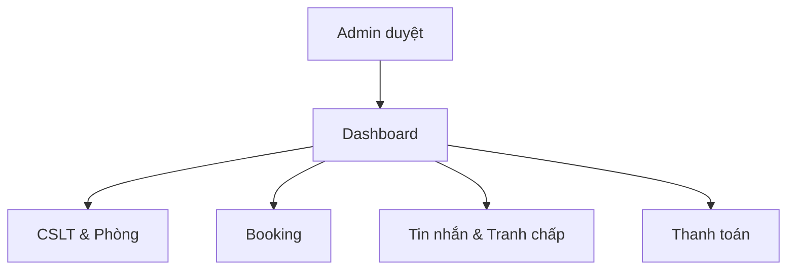
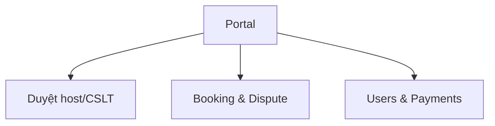

# ROVVA — Mô tả màn hình & luồng chức năng

> Mô tả **từng giao diện** và **luồng thao tác** của 3 stakeholder: Client (khách vãng lai / thành viên), Host, Admin.  
> **Cập nhật:** 12/07/2026 — bám sát routes (`backend/app/routes/`) và templates (`frontend/templates/`).

**Ký hiệu:** 🔓 không cần login · 🔒 `@login_required` · 🟡 UI có, logic chưa đầy đủ · ⚠️ route/template lỗi

**Thống kê template:** 144 file HTML — customer 71, host 43, admin 24, auth 6.

---

## 0. Layout chung & Auth

### 0.1 Đăng ký — `/register`

| | |
|---|---|
| Template | `auth/register.html` |
| Quyền | 🔓 |
| Thành phần | Họ tên, email, SĐT, mật khẩu, xác nhận MK |
| Chức năng | Tạo `User` role `guest`; redirect trang xác thực |

### 0.2 Đăng nhập — `/login`

| | |
|---|---|
| Template | `auth/login.html` |
| Quyền | 🔓 |
| Chức năng | Flask-Login; redirect guest→`/customer/`, host→`/host/`, admin→`/admin/` |
| Ghi chú | Hỗ trợ `?next=` |

### 0.3 Quên / đặt lại mật khẩu

| Màn hình | Route | Template | Trạng thái |
|----------|-------|----------|------------|
| Quên MK | `/forgot-password` | `auth/forgot_password.html` | ⚠️ **Thiếu** → 404 |
| Đặt lại MK | `/reset-password/<token>` | `auth/reset_password.html` | ⚠️ **Thiếu** → 404 |
| Thông báo verify | sau register / forgot | `auth/verify_notice.html` | ✅ |

Logic token có trong `auth/routes.py`; chỉ thiếu template HTML.

### 0.4 Đăng xuất — `/logout`

Kết thúc session, redirect trang chủ.

### 0.5 Layout customer

- Base: `customer/base.html` — Bootstrap 5.3.8, `customer.css`, `app.js`
- Header guest: `header-guest.html` · Header member: `header-member.html`
- Footer, search bar, AI bubble: `includes/layout/*`, `ai-bubble.html`

### 0.6 Layout host

- Base: `host/layout/base.html` — `host.css`, `host-pages.css`, `host-ai.css`, `host.js`

### 0.7 Layout admin

- SPA: `admin/portal.html` + `admin/css/style.css`, `admin/js/script.js`
- Legacy `admin/layout/base.html` — **không** được route sử dụng

---

## 1. CLIENT — Khách vãng lai

**Header:** menu Trang chủ, Ưu đãi, Hỗ trợ, Chính sách, Trở thành Host, Đăng nhập/Đăng ký.

### Luồng tổng quát

```text
(trang chủ) → Tìm kiếm / Smart Match → Chi tiết CSLT
  → POST create booking (không cần login)
  → Checkout (nhập liên hệ) → Thanh toán → Chi tiết đơn
```

### 1.1 Trang chủ — `/customer/`

| Template | `pages/home/guest.html` |
| Thành phần | Banner, search bar, CSLT nổi bật, trending từ DB |
| Chức năng | Card → `/customer/accommodation/<id>` |

### 1.2 Tìm kiếm — `/customer/search`

| Template | `pages/home/search-results.html` |
| Thành phần | Filter sidebar (city, type, giá, tiện ích, sort); danh sách card |
| 🟡 | Ô ngày check-in/out **chưa** lọc availability backend |

### 1.3 Smart Match — `/customer/smart-search`

| Template | `pages/home/smart-results.html` |
| Chức năng | `smart_match.py` — top phòng + lý do gợi ý |

### 1.4 Chi tiết CSLT — `/customer/accommodation/<id>`

| Template | `pages/accommodation/detail.html` |
| Thành phần | Gallery, thông tin CSLT, reviews, danh sách phòng, panel đặt phòng |
| Homestay/Villa | Đặt **cả đơn vị** — overlap toàn CSLT |
| Hotel/Resort | Chọn từng phòng |
| Liên hệ ngay | `/accommodation/<id>/contact` → 🔒 redirect login |
| Yêu thích | 🟡 Chỉ khi login — `POST /customer/favorites/toggle` |
| Đặt phòng | `POST /customer/booking/create/<room_id>` → holding **20 phút** |

### 1.5 Checkout — `/customer/booking/checkout/<code>`

| Template | `pages/checkout.html` |
| Quyền | 🔓 nếu booking trong session anonymous |
| Thành phần | Form khách (bắt buộc nhập), dịch vụ phòng, promo, chọn TT |
| Promo | `WELCOME10`, `ROVVA50` (hardcoded) |
| Thanh toán | **Thanh toán online** / **Thanh toán tiền mặt** |
| POST | Cash → confirmed; online → redirect payment |

### 1.6 Thanh toán online — `/customer/booking/payment/online/<code>`

| Template | `pages/payment/online.html` + `payment-online.css/js` |
| Thành phần | Countdown 20 phút, QR VietinBank, thông tin CK, sidebar giá |
| Popup | "Đang xác nhận thanh toán" ~3s |
| POST confirm | → callback success → `paid`, `confirmed` |

### 1.7 Thanh toán tiền mặt

Không có màn riêng — xác nhận tại checkout POST.

### 1.8 Chi tiết đơn — `/customer/booking/order/<code>`

| Template | `pages/booking/detail.html` |
| Quyền | Session anonymous hoặc `guest_id` |
| 🟡 | Email mock (log console) |

### 1.9 Trợ lý AI — `/customer/chat`

| Template | `pages/chat/guest.html` |
| API | `POST /customer/booking/api/ai-chat` |
| Ghi chú | Cần `GROQ_API_KEY`; không query DB booking |

### 1.10 Marketing & hỗ trợ (catch-all)

| Màn hình | URL | Template |
|----------|-----|----------|
| Ưu đãi | `/customer/pages/marketing/promotions.html` | Tĩnh |
| Xu thưởng | `.../reward-points.html` | Tĩnh |
| Giới thiệu | `.../introduction.html` | Tĩnh |
| Become Host (marketing) | `.../become-host.html` | Form tĩnh 🟡 không POST backend |
| FAQ, guide, policy | `pages/support/*` | Tĩnh / JS hydrate |
| Blog | `/customer/blog`, `/customer/blog/<slug>` | `blog_posts.py` |

### 1.11 Chức năng cần đăng nhập

| Chức năng | Route |
|-----------|-------|
| Chuyến đi | `/customer/trips` 🔒 |
| Tài khoản, ví, tier | `/customer/account/*` 🔒 |
| Tin nhắn, đánh giá | 🔒 |
| Liên hệ host | 🔒 |

### 1.12 Template legacy (không trong luồng chính)

`payment/step1-3-*.html`, `payment/success.html`, `trip/detail-*.html`, `trip/cancel-*.html`, `hotel-*.html`, `apartment-*.html`, `search-guest.html` — có file, không route trực tiếp hoặc catch-all redirect.

---

## 2. CLIENT — Thành viên

**Header:** `header-member.html` — yêu thích, thông báo UI, dropdown tài khoản.  
**Sidebar:** `includes/account/_sidebar.html`.

### Luồng tổng quát

```text
Login → Home member → (cùng flow đặt phòng)
  → Checkout (tự điền, checkbox xu)
  → Chuyến đi / Đánh giá / Tin nhắn
```

### 2.1 Trang chủ — `/customer/` (authenticated)

Template `pages/home/member.html`.

### 2.2 Đặt phòng (khác guest)

| Điểm | Chi tiết |
|------|----------|
| `guest_id` | Gắn `current_user.id` |
| Checkout | Tự điền từ tài khoản |
| Đổi xu | Giảm 50.000đ 🟡 chưa trừ `wallet_transactions` |
| Truy cập đơn | Theo `guest_id` |

### 2.3 Chuyến đi — `/customer/trips` 🔒

| Template | `pages/trip/upcoming.html` |
| Tab | Sắp tới / Hoàn thành / Đã hủy |
| 🟡 | Card link CSLT; **chưa** link `order_detail`; không nút hủy |

### 2.4 Khu vực tài khoản

| Trang | Route | Template |
|-------|-------|----------|
| Profile | `/customer/account/profile` | `account/profile.html` |
| Ví xu | `/customer/account/wallet` | `account/wallet.html` |
| Hạng | `/customer/account/tier` | `account/tier.html` |
| Yêu thích | `/customer/account/favorites` | `account/favorites.html` |
| Đánh giá | `/customer/account/reviews` | `account/reviews-pending.html` |
| Viết review | `.../reviews/write/<booking_id>` | `review/write.html` |
| Tin nhắn | `/customer/account/messages` | `account/messages.html` |
| Bảo mật | `/customer/account/security` | `account/security.html` + `security.js` |

**Đánh giá:** Cần booking `status=completed` (admin set thủ công).

**Tin nhắn:** `POST .../messages/<id>/send`; vào từ "Liên hệ ngay" CSLT.

### 2.5 AI member — `/customer/chat`

Template `pages/chat/member.html` — cùng API Groq.

### 2.6 Become Host — `/customer/become-host` 🔒

| | |
|---|---|
| Template | ⚠️ `pages/host_registration.html` **thiếu** → 404 |
| Backend POST | Lưu `id_card`, `host_status=pending` |
| Thay thế | Marketing `become-host.html` (tĩnh) |

---

## 3. HOST

**Nav:** Tổng quan | CSLT | Booking | Báo cáo | Tranh chấp | Thanh toán | Tin nhắn

### 3.1 Dashboard — `/host/` 🔒

Template `host/index.html` — KPI, chart 7/30 ngày, booking gần đây, **gợi ý từ trợ lý vận hành thông minh** (`build_recommendations()` — giả lập, chưa ML).

### 3.2 CSLT — `/host/accommodation/accommodations/` 🔒

| Màn hình | Template | Route |
|----------|----------|-------|
| Danh sách | `accommodation/index.html` | `.../accommodations/` |
| Chi tiết | `accommodation/detail.html` | `.../accommodations/<id>` |
| Form | `accommodation/form.html` | `create`, `<id>/edit` |
| Hành động | — | pause, delete POST |

### 3.3 Phòng — `.../accommodations/<acc_id>/rooms/...` 🔒

| Màn hình | Template |
|----------|----------|
| Chi tiết | `room/detail.html` — reviews, reply |
| Form | `room/form.html` |
| Pricing | `room/pricing.html` 🟡 |
| Gợi ý giá | `room/price_suggestions.html` |

### 3.4 Booking — `/host/booking/bookings/` 🔒

| Màn hình | Template |
|----------|----------|
| Danh sách | `booking/index.html` — tab trạng thái |
| Chi tiết | `booking/detail.html` — persona, insight |
| 🟡 | Modal hủy không có POST backend |

### 3.5 Khuyến mãi — `/host/promotion/promotions/` 🔒

`promotion/index.html`, `form.html` — CRUD DB; 🟡 chưa dùng ở checkout customer.

### 3.6 Thanh toán — `/host/payment/payments/` 🔒

`payment/index.html` — tab payment_status, rút tiền POST `/withdraw`.  
🟡 Từ điển `payment_status` khác customer.

### 3.7 Tranh chấp — `/host/dispute/disputes/` 🔒

`dispute/index.html`, `detail.html` — POST respond. Customer không mở dispute.

### 3.8 Tin nhắn — `/host/message/messages/` 🔒

`message/index.html` — 3 cột: list | chat | info khách.

### 3.9 Báo cáo — `/host/report/reports/` 🔒

`report/index.html` — export CSV/PDF.

### 3.10 Thông báo — `/host/notifications` 🔒

`notifications.html` — đọc `notifications`; 🟡 runtime chủ yếu seed.

### 3.11 Hồ sơ — `/host/profile` 🔒

`profile.html` — avatar, CCCD, đổi MK.

### 3.12 AI Host — `/host/ai-chat` 🔒

`chat.html` — `POST /host/api/ai-chat`.

### 3.13 Trợ lý vận hành thông minh 🔒 ⚠️

| | |
|---|---|
| Template | `copilot/index.html` (tên file code) |
| Chức năng | Gợi ý giá & doanh thu, radar bảo trì, chân dung khách |
| Gợi ý doanh thu | **Thiết kế:** mô hình máy học · **Hiện tại:** giả lập rule engine từ occupancy — **chưa tích hợp ML** |
| ⚠️ | Blueprint chưa register → URL `/host/copilot/` 404; gợi ý ngắn vẫn hiện trên dashboard |

### 3.14 Hỗ trợ — `/host/support/*` 🔒

11 trang tĩnh trong `host/pages/support/` (faq, guides, policies, smart-pricing).

---

## 4. ADMIN

**Layout:** `admin/portal.html` — SPA, đổi view bằng `?view=` hoặc sidebar JS.  
**Guard:** `@admin_required` — `role == admin`.

### 4.1 Portal views

| View | Partial | Chức năng |
|------|---------|-----------|
| dashboard | `view_dashboard.html` | KPI, charts |
| users | `view_users.html` | Khách hàng, toggle lock |
| hosts | `view_hosts.html` | Duyệt/từ chối host |
| rooms | `view_rooms.html` | Sửa giá/trạng thái phòng |
| bookings | `view_bookings.html` | Đổi status (kể cả `completed`) |
| disputes | `view_disputes.html` | Resolve, refund |
| payments | `view_payments.html` | Reprocess |
| promotions | `view_promotions.html` | Tạo/toggle |
| admins | `view_admins.html` | CRUD admin |

### 4.2 POST actions

| Hành động | Route |
|-----------|-------|
| Duyệt host | `POST /admin/hosts/<id>/approve` |
| Duyệt CSLT | `POST /admin/accommodations/<id>/approve` |
| Đổi booking | `POST /admin/bookings/<id>/status` |
| Resolve dispute | `POST /admin/disputes/<id>/resolve` |
| Export | `GET /admin/reports/<type>/export` |

Legacy `/admin/customers`, `/admin/bookings`, … → redirect portal.

---

## 5. Sơ đồ luồng (Mermaid)

### 5.1 Guest



### 5.2 Member



### 5.3 Host



### 5.4 Admin



---

## 6. Ma trận quyền truy cập

| Nhóm | Guest | Member | Host | Admin |
|------|:-----:|:------:|:----:|:-----:|
| Home, search, đặt phòng | ✅ | ✅ | — | — |
| Checkout, thanh toán | ✅ | ✅ | — | — |
| Account, trips | — | ✅ | — | — |
| Tin nhắn | — | ✅ | ✅ | — |
| Host portal | — | — | ✅ | — |
| Admin portal | — | — | — | ✅ |

---

## 7. Ghi chú triển khai

1. Template legacy không nằm luồng chính — xem mục 1.12.
2. `become-host`, `forgot-password`, `reset-password` — template thiếu.
3. Trợ lý vận hành thông minh — dashboard OK; trang module chưa route; gợi ý giá/doanh thu giả lập.
4. Customer không hủy đơn / không mở dispute.
5. Host notification — seed only.

---

## 8. Tài liệu liên quan

- [VietBai.md](VietBai.md) · [ARCHITECTURE.md](ARCHITECTURE.md) · [ERD.md](ERD.md) · [BAO_CAO_SRS.md](BAO_CAO_SRS.md)
