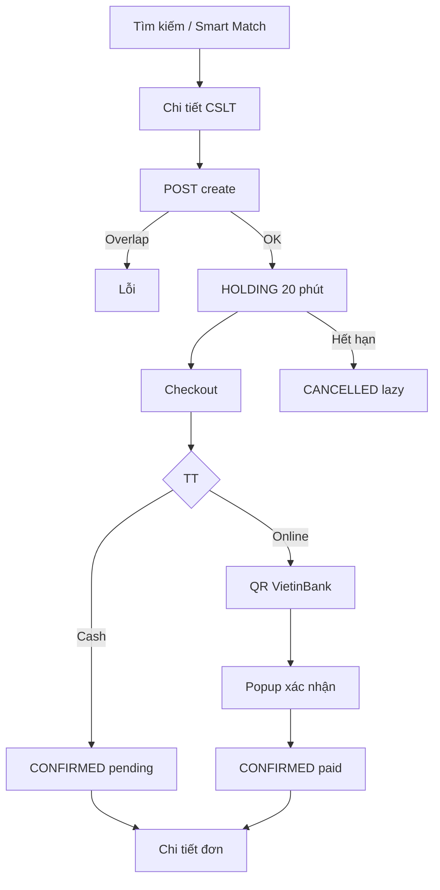
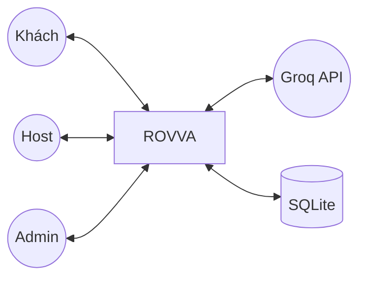

# ROVVA — Nội dung viết bài đồ án

> Mô tả **ứng dụng thực tế** của dự án ROVVA Smart Stay Platform, bám sát codebase tại **12/07/2026**.  
> Tham chiếu: [SRS.md](SRS.md), [ERD.md](ERD.md), [ARCHITECTURE.md](ARCHITECTURE.md), [ManHinh.md](ManHinh.md), [BAO_CAO_SRS.md](BAO_CAO_SRS.md).

---

## 2. Cơ sở lý thuyết và công nghệ sử dụng

### 2.1 Kiến trúc hệ thống

ROVVA triển khai **Server-Side Rendering (SSR)** trên **Flask Application Factory**, phục vụ 3 portal: Customer, Host, Admin.

```text
Trình duyệt (HTML/CSS/JS)
        ↕ HTTP
Flask Router (Blueprint theo vai trò)
        ↕
Flask-Login (session) + Route handler
        ↕
Service layer (smart_match, ai_chat, host_copilot, customer_messages, …)
        ↕
SQLAlchemy ORM  →  SQLite (instance/rova_host.db)
```

| Thành phần | Vai trò trong ROVVA |
|------------|---------------------|
| Blueprint | Tách auth, customer, customer_booking, host (9 module), admin |
| `create_app()` | Khởi tạo DB, seed, patch schema, Jinja globals |
| Service layer | Logic không nhồi template: Smart Match, AI chat, trợ lý vận hành thông minh, tin nhắn |
| Jinja2 SSR | Server render HTML; phù hợp demo đồ án |

Route `/` redirect: `admin` → `/admin/`, `host` → `/host/`, còn lại → `/customer/`.

---

### 2.2 Công nghệ thiết kế (Figma)

Giao diện thiết kế Figma trước khi code; ảnh tham chiếu tại `docs/reference/screenshots/` (nếu có).

**Triển khai:**
- Customer: font Inter, màu `#0058BE`, component Figma trong `customer.css` (~9.500 dòng)
- Thanh toán online: `payment/online.html` + `payment-online.css` — QR VietinBank
- Host/Admin: `host.css`, `host-pages.css`, `admin/css/style.css`

**Quy trình:** Figma frame → screenshot tham chiếu → HTML + Bootstrap → CSS custom.

---

### 2.3 Công nghệ Frontend

| Công nghệ | Ứng dụng |
|-----------|----------|
| HTML5 + Jinja2 | 144 templates trong `frontend/templates/` |
| CSS3 | `customer.css`, `host.css`, `payment-online.css`, `admin.css` |
| Bootstrap 5.3.8 | Grid, form, modal, navbar |
| Bootstrap Icons 1.11.x | Icon UI |
| Vanilla JS | `app.js`, `payment-online.js`, `security.js`, `ai-chat.js`, `host.js` |

```text
frontend/templates/
├── customer/   (71) — home, search, accommodation, checkout, account
├── host/       (43) — dashboard, CSLT, booking, payment, message
├── admin/      (24) — portal SPA + legacy
└── auth/       (6)  — login, register, verify
```

---

### 2.4 Công nghệ Backend

| Công nghệ | Ứng dụng |
|-----------|----------|
| Python 3.10+ | Ngôn ngữ chính |
| Flask 3 | Routing, session, flash |
| Flask-SQLAlchemy 3 | 13 bảng ORM |
| Flask-Login | `@login_required`, `current_user` |
| Werkzeug | Password hash |
| python-dotenv | `GROQ_API_KEY`, `SECRET_KEY` |
| pandas + scikit-learn | Smart Match TF-IDF |
| Groq API | AI chat (`ai_chat.py`) |

```text
backend/app/
├── routes/     — auth, customer, host/*, admin
├── models/     — User, Accommodation, Room, Booking, …
├── services/   — smart_match, ai_chat, host_copilot, member_tier, …
├── utils/      — media, display helpers
└── seed.py     — demo data + patch
```

**Luồng đặt phòng:** `POST create` → holding 20 phút → checkout → cash/online → `confirmed`.

---

### 2.5 Database

| Hạng mục | Chi tiết |
|----------|----------|
| Hệ QTCSDL | SQLite — `instance/rova_host.db` |
| ORM | Flask-SQLAlchemy |
| Số bảng | **13** — [ERD.md](ERD.md) |
| Khởi tạo | `py -m flask --app run seed` hoặc auto khi startup |
| Patch | `guest_id` conversations, review fields, notifications, … |

Bảng lõi: `users`, `accommodations`, `rooms`, `bookings`, `reviews`, `conversations`, `messages`, `wallet_transactions`, `favorites`, `promotions`, `withdrawals`, `disputes`, `notifications`.

Ảnh: file tĩnh theo ID — [HUONG_DAN_ANH_DEMO.md](HUONG_DAN_ANH_DEMO.md).

---

### 2.6 AI trong hệ thống (3 lớp khác nhau)

#### A. Smart Match — gợi ý phòng từ DB

- File: `services/smart_match.py`
- TF-IDF + cosine similarity, blend rating 85%/15%
- Route: `GET /customer/smart-search?q=...`
- Dữ liệu: mô tả phòng thật trong SQLite (12 CSLT demo)

#### B. Trợ lý Rovva AI — Groq LLM

- File: `services/ai_chat.py`
- Model: `llama-3.3-70b-versatile` (cấu hình `GROQ_MODEL`)
- Customer: bubble + `/customer/chat` — `POST /customer/booking/api/ai-chat`
- Host: `/host/ai-chat` — `POST /host/api/ai-chat`
- **Không** query DB booking — tư vấn qua prompt

#### C. Trợ lý vận hành thông minh

Bộ service `host_copilot/` — **không phải LLM**, xử lý phân tích vận hành cho host:

| Thành phần | Mô tả |
|------------|-------|
| Chân dung khách (`persona.py`) | Suy luận loại khách từ booking — rule-based |
| Radar bảo trì (`maintenance.py`) | Quét review/tin nhắn, phát hiện vấn đề cơ sở vật chất |
| **Gợi ý tối ưu giá bán và doanh thu** (`revenue.py`) | **Thiết kế:** mô hình máy học dự báo occupancy & đề xuất giá · **Hiện tại:** `build_recommendations()` **giả lập** theo rule từ occupancy — **chưa tích hợp ML** |

- Dashboard host (`/host/`) hiển thị gợi ý ngắn từ `build_recommendations()`.
- Trang module đầy đủ (`copilot/index.html`) chưa kết nối route.

---

## 3. Phân tích và thiết kế hệ thống

### 3.3 Phân tích yêu cầu — đối chiếu implementation

| Nhóm FR | Đã triển khai | Một phần | Chưa |
|---------|---------------|----------|------|
| Tài khoản | Đăng ký, login, profile, security | Email verify mock, forgot MK (template thiếu) | — |
| Host onboarding | Admin duyệt | Form become-host 404 | — |
| CSLT/phòng | CRUD host + admin | Upload ảnh, dynamic pricing | — |
| Đặt phòng | Search, detail, hold 20 phút, overlap | Lọc ngày search | Hủy customer |
| Thanh toán | QR mock + tiền mặt | Verify giả lập | Gateway thật |
| Lưu trú | Review, dispute host/admin | — | Check-in/out |

Chi tiết: [BAO_CAO_SRS.md](BAO_CAO_SRS.md).

---

### 3.4 BPMN — Đặt phòng và thanh toán



---

### 3.5 DFD mức 0



---

### 3.6 Use Case chính

**UC Đặt phòng:**
- Actor: khách vãng lai hoặc member
- Route: `POST /customer/booking/create/<room_id>`
- Hậu điều kiện: `bookings` holding; anonymous → session

**UC Thanh toán online:**
- Actor: khách checkout
- Route: `payment/online/<code>` → confirm → callback `?status=success`

**UC Tin nhắn host:**
- `get_or_create_host_conversation()` → `Message` sender_type guest/host

---

### 3.7 ERD

Chi tiết 13 bảng: [ERD.md](ERD.md).

Thiết kế đáng chú ý:
- Snapshot khách trên `bookings` (hỗ trợ vãng lai)
- `hold_expiry_at` — 20 phút
- `payment_status` — từ điển khác customer vs host portal

---

## 4. Xây dựng hệ thống

### 4.3 Giao diện theo vai trò

Tóm tắt — chi tiết từng màn hình: [ManHinh.md](ManHinh.md).

#### Customer (guest)
- Home, search, smart-search, detail, checkout, payment online, AI chat
- Đặt không login; checkout bắt buộc nhập liên hệ

#### Customer (member)
- Cùng flow + `guest_id`, trips, wallet, tier, favorites, reviews, messages, security
- Checkbox xu 50.000đ 🟡 chưa trừ DB

#### Host
- Dashboard, CSLT/phòng, booking, payment, promotion, dispute, message, report, notifications, AI chat
- Chỉ thấy data `host_id == current_user.id`

#### Admin
- Portal SPA 9 view — `admin_portal.build_portal_context()`

---

### 4.4 Case Study AI Chatbot

**Công nghệ:** Groq, `llama-3.3-70b-versatile`, prompt tiếng Việt trong `ai_chat.py`.  
**Truy cập:** bubble hoặc `/customer/chat`.

> Chatbot dùng LLM + prompt, **không** RAG từ DB. Gợi ý phòng cụ thể → dùng **Smart Match** hoặc **Tìm kiếm**.

| Case | Input ví dụ | Kết quả |
|------|-------------|---------|
| 1 | Địa điểm biển + núi | LLM gợi ý địa danh; Smart Match tìm phòng DB |
| 2 | Lịch trình 2N1Đ Nha Trang | LLM lập lịch; user search Nha Trang → CSLT seed |
| 3 | Quán local Nha Trang | LLM ẩm thực — không lưu DB |
| 4 | Must-try Nha Trang | LLM gợi ý hoạt động |
| 5 | Hướng dẫn đặt phòng Rovva | LLM mô tả flow 20 phút + QR — đúng `booking.py` |

**API test:**
```http
POST /customer/booking/api/ai-chat
Content-Type: application/json

{"message": "Lịch trình 2 ngày 1 đêm Nha Trang", "history": []}
```

---

### 4.5 Kiểm thử và đánh giá

**Phương pháp:** Kiểm thử **thủ công** trên `http://127.0.0.1:5000`. Dự án **chưa có** automated test (không có thư mục `tests/`).

| ID | Module | Kịch bản | TT |
|----|--------|----------|-----|
| T01 | Auth | Login `1@ss`/`1` | ✅ |
| T02 | Auth | Login host → `/host/` | ✅ |
| T03 | Search | Lọc Nha Trang | ✅ |
| T04 | Smart Match | Query tiếng Việt | ✅ |
| T05 | Booking | Overlap ngày | ✅ |
| T06 | Booking | Hết 20 phút | ✅ |
| T07 | Payment | Online QR | ✅ |
| T08 | Payment | Tiền mặt | ✅ |
| T09 | Security | Đổi MK sai | ✅ |
| T10 | Messages | Liên hệ CSLT | ✅ |
| T11 | Host | Scope booking | ✅ |
| T12 | Admin | Duyệt host | ✅ |
| T13 | AI | Không GROQ_API_KEY | ✅ lỗi cấu hình |
| T14 | Review | Chưa completed | ✅ chặn |
| T15 | Trips | List member | ✅ |
| T16 | Auth | Forgot password | ⚠️ 404 template |

---

## 5. Kết luận

### 5.1 Kết quả đạt được

1. Luồng đặt phòng end-to-end: giữ chỗ 20 phút → checkout → QR/tiền mặt → đơn hàng.
2. Smart Match TF-IDF gắn dữ liệu SQLite thật.
3. AI Chat Groq (customer + host).
4. Trợ lý vận hành thông minh: chân dung khách, radar bảo trì, gợi ý giá & doanh thu (giả lập — ML chưa tích hợp).
5. Portal Customer (account đầy đủ), Host (vận hành), Admin (SPA).
6. 13 bảng CSDL + seed 12 CSLT, 32 phòng, ~104 ảnh demo.
7. Tài liệu đồng bộ codebase.

### 5.2 Chưa hoàn thiện

- Template thiếu: `host_registration`, `forgot_password`, `reset_password`
- Route trang trợ lý vận hành thông minh chưa kết nối
- Gợi ý giá & doanh thu: chưa tích hợp mô hình ML (đang giả lập)
- Hủy booking, check-in/out, customer dispute
- Gateway/email thật; xu/promotion host chưa khép checkout
- Notification runtime; dynamic pricing; automated tests

### 5.3 Hạn chế

- Môi trường demo: mock payment, mock email, chưa HTTPS
- SQLite không phù hợp production đa CCU
- AI chat không verify thông tin địa phương từ DB
- RBAC host chưa siết `role=host`

### 5.4 Hướng phát triển

PostgreSQL, payment gateway VNPay/MoMo, WebSocket notification, RAG chatbot, **tích hợp ML cho gợi ý giá & doanh thu**, pytest, deploy HTTPS, hoàn thiện lifecycle booking.

---

## Phụ lục

```powershell
pip install -r requirements.txt
py -m flask --app run seed
py run.py
```

| Vai trò | Email | Mật khẩu |
|---------|-------|----------|
| Customer | `1@ss` | `1` |
| Host | `van.quangia@rova.vn` | `password123` |
| Admin | `admin@rova.vn` | `admin123` |

```env
GROQ_API_KEY=your_key_here
```

---

*Tài liệu viết bài — `docs/VietBai.md` — chỉ mô tả tính năng có trong mã nguồn.*
